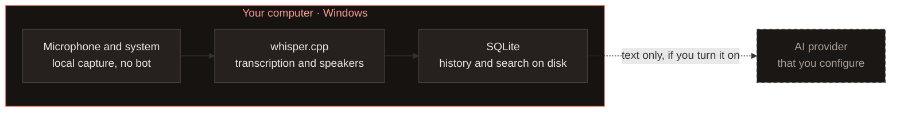

<div align="center">

<a href="https://isper.pages.dev"></a>

# ISPer

**Your words. On your computer.**

Dictate into any app and transcribe meetings with local AI.<br>
No subscription, and your audio never goes to an API.

[](https://github.com/Marcus-Boni/ISPer/releases/latest)
[](https://github.com/Marcus-Boni/ISPer/actions/workflows/ci.yml)
[](https://isper.pages.dev/download/)
[](LICENSE)

[**Download**](https://isper.pages.dev/download/) · [Documentation](https://isper.pages.dev/docs/) · [Website](https://isper.pages.dev) · [Português](README.md)

<br>

<a href="docs/media/isper-launch.mp4"></a>

<sub>The first 15 seconds of the launch video, in Portuguese · [watch the whole video, with sound](docs/media/isper-launch.mp4)</sub>

</div>

<br>

> This is the English translation of [README.md](README.md). The Portuguese README is the reference; if the two disagree, it wins.

## Hold. Speak. Release.

| | |
|---|---|
| **Hold** | the shortcut (`Ctrl` + `Alt` + `Space`) in any app: Teams, Outlook, a browser, an editor. |
| **Speak** | freely. A live caption appears in the ISPer indicator, floating over whatever you are using. |
| **Release** | and the text lands where your cursor was, already punctuated. Your history keeps all of it. |

Rather not hold? A quick tap on the shortcut starts hands-free mode, and a pause ends it on its own.

## What ISPer does

<table>
<tr>
<td width="50%" valign="top">

**Dictation in any app**<br>
Voice commands for punctuation ("nova linha", "vírgula"…), a personal dictionary for the names and terms of your work, and optional AI polishing.

</td>
<td width="50%" valign="top">

**Teams meetings, no bot in the call**<br>
Records your microphone and the computer's audio, notices when a call starts, and separates who said what.

</td>
</tr>
<tr>
<td valign="top">

**A searchable library**<br>
Every meeting becomes minutes in Markdown and DOCX, with marked moments (`Ctrl` + `Alt` + `K`), word search and, if you want, search by meaning.

</td>
<td valign="top">

**AI when you want it**<br>
A summary, decisions and action items when the meeting ends, and a Copilot that follows the conversation live. With Groq, Gemini or Claude, and on the text only.

</td>
</tr>
<tr>
<td valign="top">

**Fast on your machine**<br>
Whisper running locally, on the CPU or on an NVIDIA GPU. On an RTX 4050, 10.4 s of audio come out in 0.6 s.

</td>
<td valign="top">

**One window**<br>
Home, Library and Settings in one sidebar, with a command palette (`Ctrl` + `K`). The interface speaks Portuguese and English, in light and dark themes.

</td>
</tr>
</table>

## Audio never crosses this line



Capture, transcription and speaker identification happen on your computer. With no AI provider configured, nothing leaves the machine. With one configured, only the text you ask it to summarize goes there. The key lives in Windows Credential Manager, never in a file.

## Download

| Build | For | Installer | Portable (zip) |
|---|---|---|---|
| **CPU** | any x64 PC with AVX2 (Windows 10 or 11) | ~15 MB | ~21 MB |
| **CUDA** | NVIDIA GPU owners | ~430 MB | ~455 MB |

**[Pick your build on the website →](https://isper.pages.dev/download/)** The page lists each file's size and SHA-256 checksum, and shows the command that verifies your download. Every version is in the [GitHub releases](https://github.com/Marcus-Boni/ISPer/releases).

The app tells you when a new version is out and updates in one click, checking the signature before installing. The installer has no Authenticode certificate yet, so Windows asks on the first run: *More info → Run anyway*.

## For developers

ISPer is written in **Rust**, with **Tauri 2** and **whisper.cpp**; speaker identification uses **sherpa-onnx**. The interface is HTML, CSS and JavaScript with no build step, and it runs offline.

```bash
cargo build --release
```

CUDA is on by default; without an NVIDIA GPU, add `--no-default-features`. Windows needs VS Build Tools 2022, CMake and libclang.

| | |
|---|---|
| [**Development**](docs/DEVELOPMENT.md) | layout, toolchain, CUDA, models, every part of the app, installer, diagnostics and tests |
| [Transcription pipeline](docs/transcription-pipeline.md) | live and final passes, VAD, speakers and how to measure them |
| [Decisions (ADRs)](docs/adr/README.md) | why the project is the way it is |
| [Tests](docs/TESTES.md) · [Release](docs/RELEASE.md) | the test strategy and how a version ships |
| [Roadmap](ROADMAP.md) · [Changelog](CHANGELOG.md) | what is coming and what changed |

The ADRs, the roadmap and most of `docs/` are in Portuguese.

## Contributing

Contributions come in through pull requests with a green CI. [CONTRIBUTING.md](CONTRIBUTING.md) explains the environment and the workflow, and the [Code of Conduct](CODE_OF_CONDUCT.md) the ground rules. Found a vulnerability? Report it privately on GitHub (*Security → Report a vulnerability*); the details are in [SECURITY.md](SECURITY.md).

## License

[MIT](LICENSE). Whisper (MIT) · whisper.cpp (MIT) · Tauri (MIT/Apache-2.0) · sherpa-onnx (Apache-2.0). Every model it uses has open weights.

<div align="center">
<br>
<sub>Made for people who need to keep their ideas and meetings without turning confidential audio into someone else's data.</sub>
</div>
