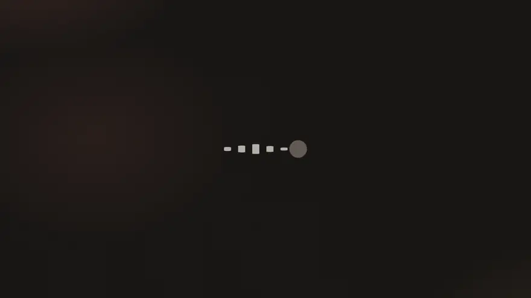
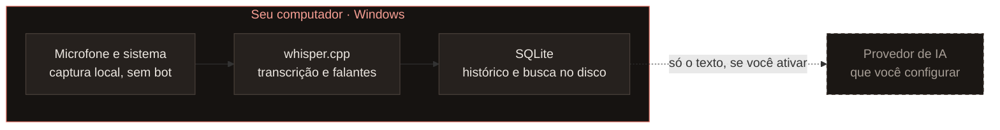

<div align="center">

<a href="https://isper.pages.dev"></a>

# ISPer

**Suas palavras. No seu computador.**

Dite em qualquer aplicativo e transcreva reuniões com IA local.<br>
Sem mensalidade e sem enviar seu áudio para uma API.

[](https://github.com/Marcus-Boni/ISPer/releases/latest)
[](https://github.com/Marcus-Boni/ISPer/actions/workflows/ci.yml)
[](https://isper.pages.dev/download/)
[](LICENSE)

[**Baixar**](https://isper.pages.dev/download/) · [Documentação](https://isper.pages.dev/docs/) · [Site](https://isper.pages.dev) · [English](README.en.md)

<br>

<a href="docs/media/isper-launch.mp4"></a>

<sub>Os primeiros 15 segundos do vídeo de lançamento · [assista ao vídeo inteiro, com som](docs/media/isper-launch.mp4)</sub>

</div>

<br>

## Segure. Fale. Solte.

| | |
|---|---|
| **Segure** | o atalho (`Ctrl` + `Alt` + `Espaço`), em qualquer aplicativo: Teams, Outlook, navegador, editor. |
| **Fale** | à vontade. A legenda aparece ao vivo no indicador do ISPer, flutuando sobre o que você estiver usando. |
| **Solte** | e o texto cai onde o cursor estava, já com pontuação. Seu histórico guarda tudo. |

Prefere não segurar? Um toque rápido no atalho liga o modo mãos-livres, e uma pausa encerra sozinha.

## O que o ISPer faz

<table>
<tr>
<td width="50%" valign="top">

**Ditado em qualquer aplicativo**<br>
Comandos de voz para pontuação ("nova linha", "vírgula"…), dicionário pessoal para nomes e termos do seu trabalho, e polimento opcional por IA.

</td>
<td width="50%" valign="top">

**Reuniões do Teams, sem bot na chamada**<br>
Grava o microfone e o áudio do computador, percebe quando uma chamada começa e separa quem falou o quê.

</td>
</tr>
<tr>
<td valign="top">

**Biblioteca pesquisável**<br>
Cada reunião vira uma ata em Markdown e DOCX, com momentos marcados (`Ctrl` + `Alt` + `K`), busca por palavra e, se você quiser, por sentido.

</td>
<td valign="top">

**IA quando você quiser**<br>
Resumo, decisões e ações ao fim da reunião, e um Copilot que acompanha a conversa ao vivo. Com Groq, Gemini ou Claude, e só sobre o texto.

</td>
</tr>
<tr>
<td valign="top">

**Rápido na sua máquina**<br>
Whisper rodando localmente, em CPU ou em GPU NVIDIA. Numa RTX 4050, 10,4 s de áudio saem em 0,6 s.

</td>
<td valign="top">

**Uma janela só**<br>
Início, Biblioteca e Configurações numa barra lateral, com a paleta de comandos (`Ctrl` + `K`). Interface em português e inglês, nos temas claro e escuro.

</td>
</tr>
</table>

## O áudio não atravessa esta linha



A captura, a transcrição e a identificação de falantes acontecem no seu computador. Sem provedor de IA configurado, nada sai da máquina. Com um configurado, só o texto que você pedir para resumir vai até ele. A chave fica no Gerenciador de Credenciais do Windows, nunca em arquivo.

## Baixar

| Versão | Para quem | Instalador | Portátil (zip) |
|---|---|---|---|
| **CPU** | qualquer PC x64 com AVX2 (Windows 10 ou 11) | ~15 MB | ~21 MB |
| **CUDA** | quem tem GPU NVIDIA | ~430 MB | ~455 MB |

**[Escolher a versão no site →](https://isper.pages.dev/download/)** A página confere o tamanho e a soma SHA-256 de cada arquivo e mostra o comando que verifica o download. Todas as versões estão nas [releases do GitHub](https://github.com/Marcus-Boni/ISPer/releases).

O app avisa quando sai uma versão nova e se atualiza com um clique, conferindo a assinatura antes de instalar. O instalador ainda não tem certificado Authenticode, então o Windows pergunta na primeira execução: *Mais informações → Executar assim mesmo*.

## Para quem desenvolve

O ISPer é escrito em **Rust**, com **Tauri 2** e **whisper.cpp**; a identificação de falantes usa **sherpa-onnx**. A interface é HTML, CSS e JavaScript sem etapa de build, e roda offline.

```bash
cargo build --release
```

O CUDA vem ligado por padrão; sem GPU NVIDIA, acrescente `--no-default-features`. O Windows precisa de VS Build Tools 2022, CMake e libclang.

| | |
|---|---|
| [**Desenvolvimento**](docs/DESENVOLVIMENTO.md) | estrutura, toolchain, CUDA, modelos, cada parte do app, instalador, diagnóstico e testes |
| [Pipeline de transcrição](docs/transcription-pipeline.md) | ao vivo e passe final, VAD, falantes e como medir |
| [Decisões (ADRs)](docs/adr/README.md) | por que o projeto é como é |
| [Testes](docs/TESTES.md) · [Release](docs/RELEASE.md) | a estratégia de testes e como uma versão sai |
| [Roadmap](ROADMAP.md) · [Changelog](CHANGELOG.md) | o que vem e o que mudou |

## Contribuir

Contribuições entram por pull request, com o CI verde. O [CONTRIBUTING.md](CONTRIBUTING.md) explica o ambiente e o fluxo, e o [Código de Conduta](CODE_OF_CONDUCT.md) as regras de convivência. Achou uma vulnerabilidade? Relate em privado pelo GitHub (*Security → Report a vulnerability*); os detalhes estão no [SECURITY.md](SECURITY.md).

## Licença

[MIT](LICENSE). Whisper (MIT) · whisper.cpp (MIT) · Tauri (MIT/Apache-2.0) · sherpa-onnx (Apache-2.0). Todos os modelos usados têm pesos abertos.

<div align="center">
<br>
<sub>Feito para quem precisa registrar ideias e reuniões sem transformar áudio confidencial em dado de terceiros.</sub>
</div>
