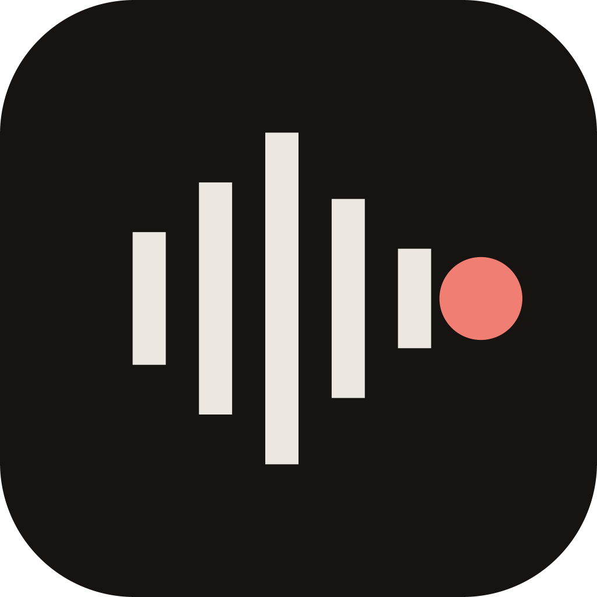

# A marca do ISPer

Uma só, em todas as plataformas: o ícone do desktop, a bandeja, as notificações, o
launcher do Android, o favicon, a imagem de compartilhamento e o portal.



Cinco barras de fala, centradas numa linha média, e o ponto de gravação. É o gesto
do próprio indicador do ISPer — a forma de onda que aparece enquanto ele escuta e o
ponto que diz que está gravando. Por isso ela substituiu as outras duas: as barras em
losango sobre vermelho do desktop e as três barras apoiadas embaixo do portal eram
ícones genéricos de áudio, e nenhuma delas tinha o ponto.

## Não edite os ícones — edite o script

Todo arquivo de marca do repositório é gerado por [`scripts/brand.py`](../../scripts/brand.py)
a partir de uma geometria só. Editar um PNG à mão é como a marca virou três da
primeira vez.

```bash
python scripts/brand.py            # regrava tudo
python scripts/brand.py --check    # sai 1 se algum arquivo estiver defasado
```

Precisa só de Python e Pillow. O script é a fonte da verdade; os SVGs desta pasta são
saídas, para quem compõe com a marca fora do código.

## Os arquivos

| arquivo | serve para |
|---|---|
| `isper-mark.svg` | a marca sem placa, enquadrada pela própria caixa — para compor sobre fundo escuro |
| `isper-icon.svg` | a placa do app, na moldura do launcher do Android |
| `isper-icon-small.svg` | a placa para 32 px e menos |
| `isper-icon-1024.png` | a placa grande, para loja, apresentação e vídeo |

E, gerados nos lugares em que cada plataforma os procura:

- **Desktop** — `apps/isper-app/src-tauri/icons/`: o que o `tauri.conf.json` empacota
  (`32x32.png`, `128x128.png`, `128x128@2x.png`, `icon.ico`), os demais tamanhos, e os
  dois estados da bandeja (`tray.rgba`, `tray-recording.rgba`, com `.png` ao lado para revisão).
- **Android** — `apps/isper-android/app/src/main/res/drawable/ic_launcher_foreground.xml`,
  o primeiro plano do ícone adaptativo. Foi o desenho original; agora é derivado dele.
- **Portal** — `website/src/app/icon.svg` e `favicon.ico`, `apple-icon.png`, os ícones do
  manifesto em `website/public/icons/`, e `website/src/lib/brand-mark.ts`, a geometria
  que a imagem de compartilhamento e os componentes leem.

## Geometria

No canvas de 108 do ícone adaptativo, de onde a marca veio:

- cinco barras de largura 4 em x = 34, 42, 50, 58, 66, com alturas 16, 28, 40, 24, 12,
  todas centradas em y = 54 — a fala sobe até o meio e decai mais depressa do que subiu;
- o ponto de gravação em (76, 54), raio 5.

A caixa da marca não fica no centro da placa; a **massa** fica. As barras pesam à
esquerda e o ponto puxa à direita, e o centro de massa cai a 0,7 de unidade do centro.
Não "corrija" a assimetria das margens — ela é o que deixa a marca equilibrada.

## Cores

Só as do [DESIGN.md](../../website/DESIGN.md), e nenhuma outra:

| | | |
|---|---|---|
| placa | `#161311` | warm-void |
| barras | `#ECE7E1` | ivory |
| ponto | `#F07E72` | terracotta |
| ponto apagado (bandeja) | `#8D847C` | muted |

## Tamanho óptico

A mesma marca, enquadrada de três jeitos conforme o tamanho em que ela vai viver:

- **48 px para cima** — a área visível do launcher do Android (72 de 108). O ícone do
  desktop tem a proporção exata do celular.
- **32 px** — uma moldura mais justa (64), em que quatro unidades valem dois pixels: as
  barras e os vãos caem inteiros na grade.
- **Abaixo de 32 px** — *hinting*, como em fonte. A 24 px quatro unidades valeriam 1,5 px
  e cada barra ficaria com franja cinza; a 16 px o vão de uma unidade antes do ponto
  valeria 0,25 px e o ponto se fundiria com a onda. Ali as barras são dispostas direto
  em pixels inteiros, com todas as alturas na mesma paridade para dividirem uma linha
  média, e o ponto ganha ao menos um pixel de folga.

Por isso o `.ico` não é gerado pelo gravador do Pillow, que redimensionaria uma imagem só
para todos os tamanhos: cada quadro é desenhado para o seu.

## O ponto é uma luz

No ícone do app o ponto é a cor da marca. Na **bandeja** ele é o que sempre foi no
indicador: a luz de gravação — apagado (`#8D847C`) enquanto o ISPer só espera, aceso
em terracota enquanto uma reunião grava. Antes, a bandeja pintava um segundo ponto
vermelho por cima do ícone; com a marca nova, que já tem o seu, isso daria dois.

A barra de status do Android **não** usa a marca: ali o ícone é um glifo funcional que
o sistema pinta de branco (o microfone, só durante a gravação).
