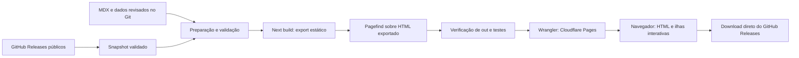

# Plano de implementação — Portal oficial do ISPer

**Data:** 15 de setembro de 2026.

**Estado:** implementação local concluída em 16 de setembro de 2026; publicação no Cloudflare Pages depende das credenciais e do projeto configurados no GitHub.

**Entregável inicial:** este documento foi aprovado antes da implementação; o portal resultante está isolado em `/website`.
**Destino proposto:** `/website`, isolado do desktop; publicação estática em `https://<projeto>.pages.dev`. O nome depende da disponibilidade no Cloudflare.

**Leitura sugerida:** começar pelas decisões de revisão na seção 2.1, seguir para as seis fases na seção 13 e conferir a definição de pronto na seção 16. As seções intermediárias especificam a execução e os contratos de cada área.

## 1. Resultado esperado e princípios

Construir um portal em português do Brasil com três jornadas principais: entender o ISPer, baixar a variante correta para Windows e conseguir usar o produto com documentação confiável. A experiência deve ampliar a identidade editorial quente do desktop, mostrar o funcionamento por uma demonstração acessível e reduzir a distância entre o primeiro acesso e o primeiro ditado.

1. **Produto verdadeiro:** cada alegação pública deve corresponder ao comportamento da versão distribuída. Funcionalidades solicitadas ainda ausentes continuam registradas neste plano como dependências explícitas.
2. **HTML útil desde a primeira resposta:** títulos, conteúdo, links de download, tabelas e documentação chegam prontos; JavaScript acrescenta interatividade.
3. **Identidade reconhecível:** tokens e fontes partem de `apps/isper-app/ui/assets/base.css`; a composição web ganha escala, espaço e responsividade próprios.
4. **Movimento com propósito:** cada biblioteca tem responsabilidade delimitada, carregamento seletivo e modo reduzido funcional.
5. **Entrega reproduzível:** build, conteúdo, dados de release e verificações produzem um artefato estático identificável, publicável e reversível.

### 1.1 Escopo incluído

- Landing page `/`, download `/download`, índice `/docs` e todos os guias definidos na seção 9.
- Documentação MDX, Shiki em build, busca local, navegação contextual e acessibilidade.
- Mockup HTML/SVG baseado nas telas Início e Biblioteca, com dados fictícios identificados como demonstração.
- Benchmarks com metodologia, procedência e estados para ausência de medição.
- SEO, cartões sociais, sitemap, robots, 404, responsividade e auditorias.
- Workflow exclusivo do website no GitHub Actions e Cloudflare Pages por Direct Upload.
- Documentação operacional do portal, política de conteúdo e evidências de validação.

### 1.2 Limites

- Não alterar Rust, Tauri, pipeline desktop, banco local, modelos, configurações nem credenciais do usuário para construir o portal.
- Não criar backend, autenticação, processamento de áudio no navegador, upload de reuniões, newsletter ou SaaS de busca.
- Não copiar `isper.db`, `reunioes/`, modelos, chaves ou conteúdo de reuniões reais para assets, exemplos ou índices públicos.
- A criação de suporte desktop a DirectML, pacote portátil e novos providers de resumo exige trabalho separado. Aprovar este portal não autoriza tais mudanças automaticamente.
- Nenhuma promessa de TTFB literalmente instantâneo ou disponibilidade universal: o export elimina computação de servidor por requisição; rede, cache e dispositivo continuam influenciando os tempos.

## 2. Auditoria do repositório e conciliação do briefing

As referências abaixo são evidências do checkout inspecionado nesta data. Documentação local não prova que todos os assets já foram publicados; a disponibilidade pública deve ser validada na Fase 4.

| Tema | Evidência local | Decisão proposta |
|---|---|---|
| Tecnologia desktop | `README.md:3`, `README.md:8`, `apps/isper-app/src-tauri/Cargo.toml:1` | Guias de fonte usam Rust, Cargo, Tauri e ferramentas C++; Python/PyInstaller não descreve a arquitetura atual. Python aparece apenas se necessário para ferramentas auxiliares documentadas. |
| Identidade | `apps/isper-app/ui/assets/base.css:7`, `:22`, `:34`, `:38`, `:79`, `:107` | Reutilizar valores e fontes OFL; adaptar escala web sem importar todo o CSS desktop. |
| Ruído | `apps/isper-app/ui/assets/base.css:90` usa 5% | Portal usa 4%, conforme solicitação; registrar a diferença intencional. |
| Telas reais | `apps/isper-app/ui/home.html`, `apps/isper-app/ui/library.html` | Recriar apresentação e estados com fixtures; nunca importar scripts que acessam `window.__TAURI__`. |
| Versão do código | `apps/isper-app/src-tauri/Cargo.toml:3` contém `0.15.0` | Versão exibida no portal vem da release estável publicada, não de um número fixo ou da branch de desenvolvimento. |
| Atalho | `README.md:133`, `apps/isper-app/src-tauri/src/shortcuts.rs:66` | O padrão é `Ctrl + Alt + Espaço`; `Ctrl + Shift + Espaço` é alternativa configurável/fallback. A demo pode usar a combinação solicitada com esse rótulo explícito. |
| Hardware | `apps/isper-app/src-tauri/Cargo.toml:10`, `.cargo/config.toml:18` | CPU e CUDA são as variantes verificadas. DirectML não está comprovado como backend distribuído. Não anunciar aceleração AMD; direcionar AMD à opção CPU enquanto isso. |
| Resumos | `crates/isper-llm/src/providers.rs:28` | A fábrica atual implementa Claude/Anthropic, Groq e Gemini/Google. Não apresenta provider de resumo Ollama ou OpenAI direto. |
| Embeddings | `crates/isper-llm/src/embeddings.rs:10`, `:27`, `:106`, `:229` | Há caminho compatível com OpenAI para embeddings, inclusive Ollama local. Isso não equivale a suporte a resumos locais. |
| Modelos disponíveis | `crates/isper-models/src/lib.rs:50` | Catálogo atual: Small, Medium q5, Large v3 q5 e Large v3 Turbo q5. Tiny/Base não foram encontrados no catálogo; podem ser explicados conceitualmente, sem instruções de seleção inexistente. |
| IA opcional em nuvem | `README.md`, seção “Polimento por IA”; `crates/isper-llm/src/providers.rs` | Transcrição local e envio opcional de texto são explicados separadamente; “áudio local” não implica “nenhum dado sai”. |
| Distribuição | `docs/RELEASE.md`, seção “O que sai em cada release”; `scripts/release-assets.ps1:115` | Instaladores x64 separados CPU/GPU, manifests e SHA256SUMS. ZIP portátil não está estabelecido nesse contrato. |
| Assinatura | `docs/RELEASE.md`, seção “Assinatura Authenticode” | Minisign do atualizador e SHA-256 não são Authenticode. O estado público de assinatura será verificado por versão; não prometer ausência de SmartScreen. |
| Licença e autoria | `LICENSE:1`, `LICENSE:3`; arquivos OFL em `apps/isper-app/ui/assets/fonts/` | MIT do projeto e avisos de terceiros preservados; fontes mantêm licenças próprias. |
| CI existente | `.github/workflows/ci.yml`, `.github/workflows/release.yml` | Acrescentar workflow web sem substituir ou enfraquecer checks desktop. |

### 2.1 Divergências que a aprovação deste plano deve resolver

**D1 — Next.js mais recente versus “Fase 1: Next.js 15”.** Recomenda-se Next.js **16.3.x estável, com o patch corrigido mais recente disponível na implementação**, mantendo App Router e export estático. A documentação oficial já apresenta 16.3 e atualizações de segurança; a referência a 15 no roteiro está desatualizada em relação ao requisito “mais recente”. Não fixar patch presumido nem usar canary. Se a revisão determinar obrigatoriamente 15, adotar o último patch mantido e repetir a prova de compatibilidade MDX/UI. [Histórico oficial do Next.js](https://nextjs.org/blog)

**D2 — Motor de conteúdo.** Selecionar `@next/mdx`, com versão alinhada ao Next.js, em vez de manter duas opções em aberto. Contentlayer seria reconsiderado somente com prova de compatibilidade da combinação escolhida; não é necessário para este acervo local. Usar metadados exportados e validados; não assumir suporte automático a frontmatter YAML. [MDX oficial](https://nextjs.org/docs/app/guides/mdx)

**D3 — “100% local” e resumos.** Manter a proposta de valor da transcrição local. Resumos atuais em nuvem são opcionais e podem enviar texto; embeddings podem usar endpoint local ou remoto. A headline pedida — “Transcrição com IA e Resumo de Reuniões. 100% Local, Privado e Ilimitado.” — fica registrada como **copy desejada condicionada à comprovação de resumo local**. Para o produto atual, propor: **“Transcrição com IA. Local, privada e sem mensalidade.”** Complemento: “Grave reuniões, organize falas e gere resumos com o provedor de IA que você configurar.” Informar os provedores realmente suportados perto dessa opção.

**D4 — Recursos ainda ausentes.** DirectML, portátil ZIP e resumo Ollama/OpenAI têm lugar previsto na arquitetura de dados e nas páginas, mas permanecem indisponíveis até haver release e validação. Não inventar tutoriais funcionais ou links. Se esses itens forem indispensáveis ao lançamento integral, serão bloqueadores externos explícitos, sem considerar o escopo integral concluído.

**D5 — Movimento e 100/100.** Preservar as bibliotecas solicitadas com importação por necessidade e orçamento de execução. Lenis em todas as rotas elegíveis, com rolagem nativa para movimento reduzido, touch e containers internos. Pinning apenas no App Stage em desktop. A aprovação contempla essas adaptações de acessibilidade; a pontuação é meta verificável em ambiente definido, não garantia antecipada.

**D6 — Gratuidade.** Arquitetura sem serviços pagos obrigatórios: Pages Free para HTML/assets e GitHub Releases para binários. Respeitar quotas e termos vigentes; Actions e armazenamento de artefatos também dependem do plano/visibilidade do repositório. O subdomínio `pages.dev` dispensa compra de domínio. [Pages: export estático](https://developers.cloudflare.com/pages/framework-guides/nextjs/deploy-a-static-nextjs-site/)

## 3. Arquitetura técnica e fronteiras

### 3.1 Estrutura de arquivos proposta

Os caminhos desta árvore são **futuros**, salvo os arquivos de origem explicitamente citados no restante do plano.

```text
implementation_plan.md
.github/workflows/website.yml              # único novo workflow web
website/
  package.json                            # scripts, engines, packageManager
  pnpm-lock.yaml                          # lockfile independente
  .gitignore                              # .next, out, node_modules, evidências temporárias
  .env.example                            # apenas nomes e valores públicos ilustrativos
  next.config.ts                          # export, trailingSlash, MDX, imagens locais
  tsconfig.json                           # strict e checagens adicionais
  postcss.config.mjs
  eslint.config.mjs
  components.json                         # shadcn e registries selecionados
  wrangler.jsonc                          # projeto Pages e pages_build_output_dir
  mdx-components.tsx
  DESIGN.md                               # fonte de decisões visuais do portal
  README.md                               # desenvolver, verificar, publicar, reverter
  THIRD_PARTY_NOTICES.md
  src/
    app/
      layout.tsx
      page.tsx
      not-found.tsx
      download/page.tsx
      docs/layout.tsx
      docs/page.tsx
      docs/[...slug]/page.tsx
      sitemap.ts
      robots.ts
    styles/tokens.css
    styles/globals.css
    assets/fonts/                         # cópias locais e respectivas licenças
    components/
      layout/                             # header, footer, mobile navigation
      landing/                            # hero, bento, stage, shortcuts, CTA
      download/                           # seletor CPU/GPU e integridade
      docs/                               # sidebar, TOC, search, MDX primitives
      motion/                             # política, Lenis, GSAP, anime
      charts/                             # Bklit, tabelas e fallbacks
      ui/                                 # componentes shadcn selecionados
      kokonut/                            # componentes selecionados/adaptados
    lib/
      site.ts                             # origem pública, links e título
      content.ts                          # leitura do manifest gerado
      releases.ts                         # contrato/seleção de assets
      benchmarks.ts                       # validação e cálculos explícitos
      seo.ts
      utils.ts                            # utilitário compartilhado apenas quando usado
    generated/                            # manifests produzidos antes do build
  content/docs/                           # MDX revisado e versionado
  content/data/
    releases.snapshot.json                # snapshot conhecido e validado
    benchmarks.json                       # medições aprovadas ou estado indisponível
    demo.json                             # diálogo sintético e determinístico
    capabilities.json                     # status por versão e referências
  public/
    images/                               # AVIF/WebP/SVG dimensionados
    og/                                   # PNGs sociais estáticos
    _headers                              # regras efetivas do Pages
    _redirects                            # apenas redirecionamentos explícitos
  scripts/
    prepare-content.mjs
    sync-releases.mjs
    validate-content.mjs
    verify-export.mjs
    check-budgets.mjs
  tests/unit/
  tests/e2e/
  playwright.config.ts
  lighthouserc.cjs
  evidence/README.md
```

Não criar workspace Node na raiz, Turborepo, Nx ou dependência de build entre Cargo e Next.js. Todos os comandos de pacote executam em `website/` ou com `pnpm --dir website`. Nenhum import runtime atravessa a fronteira para o app desktop. Fontes e tokens são copiados de forma controlada; uma checagem de divergência pode ler os arquivos originais sem exigir compilação Rust.

### 3.2 Fluxo de geração e entrega



O snapshot torna o build determinístico e permite testes sem GitHub disponível. Atualização de releases ocorre antes de gerar páginas; não buscar versão, stars ou preços a cada visita. Nenhum segredo entra em `NEXT_PUBLIC_*`, HTML, JSON distribuído ou código client.

### 3.3 Next.js e export

- `output: 'export'`, `trailingSlash: true` e saída final `website/out/`.
- App Router e RSC para layout, conteúdo, metadados e leitura de snapshots **durante o build**. RSC aqui não implica servidor na hospedagem.
- Enumerar todos os slugs com `generateStaticParams`; `dynamicParams = false`. Slug desconhecido deve produzir 404 real.
- Não usar SSR por requisição, Server Actions, cookies de servidor, ISR, handlers dependentes de Request, proxy/middleware ou otimização de imagem que precise de servidor.
- Imagens pré-otimizadas e locais, com dimensões, `sizes` e formatos explícitos. Usar `next/image` com `unoptimized` quando aplicável ou `<picture>` com derivados locais; `unoptimized` sozinho não comprime imagens.
- Cabeçalhos e redirecionamentos ficam em arquivos do Pages, não em funções de `next.config.ts` incompatíveis com export.
- `window`, `navigator`, clipboard e media queries são lidos somente no browser, com primeiro render determinístico.
- Prova inicial: export de `/`, `/download` e um MDX dinâmico enumerado servido sem processo Next.js.

Esses limites seguem o [guia de static export do Next.js](https://nextjs.org/docs/app/guides/static-exports).

### 3.4 Stack e inventário de dependências

| Grupo | Escolha | Regra de carga/uso |
|---|---|---|
| Base | Next.js estável, React/React DOM compatíveis, TypeScript strict | Fixar combinação testada, lockfile e Node LTS suportado; sem versões canary. |
| CSS | Tailwind CSS 4 e PostCSS compatível | Tokens via CSS variables e `@theme inline`; não reproduzir configuração de v3 por hábito. |
| Primitivos | shadcn/ui com uma família consistente de primitivas acessíveis | Dialog, Tooltip, Tabs, DropdownMenu, Accordion, Sheet; só componentes usados. |
| Conteúdo | `@next/mdx`, dependências MDX requeridas, `remark-gfm`, Shiki via `@shikijs/rehype` | Compilação e destaque no build; sem engine Shiki no bundle cliente. |
| Busca | Pagefind | Indexa `out` após o build; carrega motor/índice ao abrir a busca. |
| Movimento | Lenis, GSAP/ScrollTrigger, anime.js | Importação seletiva, escopos por componente e teardown. |
| Componentes visuais | Kokonut UI e Bklit UI gratuitos | Código selecionado pelo registry, com origem/versão/licença documentadas. |
| Dependências dos registries | Motion, ícones e módulos de gráfico que os componentes escolhidos realmente exigirem | Auditar antes da instalação; deduplicar e incluir no orçamento. Não assumir que são componentes sem runtime adicional. |
| Verificação | ESLint, testes unitários, Playwright, axe, Lighthouse CI | Ferramentas de desenvolvimento, fora da aplicação distribuída. |
| Publicação | Wrangler fixado | Apenas CI/local de publicação; sem Workers runtime no portal. |

As dependências são propostas para aprovação, não foram instaladas. Bibliotecas auxiliares entram somente se necessárias aos itens aprovados; não adicionar serviços ou pacotes de efeito por conveniência. Referências: [Tailwind/Next.js](https://tailwindcss.com/docs/installation/framework-guides/nextjs), [shadcn/Next.js](https://ui.shadcn.com/docs/installation/next), [Kokonut oficial](https://github.com/kokonut-labs/kokonutui/blob/main/README.md), [Bklit instalação](https://bklit.com/docs/installation), [Shiki/rehype](https://shiki.style/packages/rehype).

## 4. Design system e direção de arte

### 4.1 Tokens obrigatórios

| Família | Variáveis e valores |
|---|---|
| Fundos | `--bg: #161311`; `--bg-2: #1b1714` |
| Superfícies | `--panel: #1e1a18`; `--panel-2: #26211e`; `--panel-3: #2f2824` |
| Bordas | `--line: #372f2b`; `--line-2: #4a403a` |
| Texto | `--ink: #ece7e1`; `--ink-2: #d3cbc3`; `--muted: #a79e96`; `--muted-2: #7e756e` |
| Coral | `--accent: #f07e72`; `--accent-2: #f79f94`; `--accent-soft: rgba(240,126,114,0.14)` |
| Texto sobre coral | `--accent-ink: #1b0f0d`, já definido no desktop |
| Status | `--good: #84c297`; `--warn: #e8c15a`; `--info: #7cc4f0` |
| Falantes | `--p1: #7cc4f0`; `--p2: #c9a0f0`; `--p3: #f0c97c`; `--p4: #7cf0c9`; `--p5: #f0a07c` |
| Raios | `--r-sm: 8px`; `--r: 12px`; `--r-lg: 16px`; `--r-pill: 999px` |
| Movimento base | 120, 200, 320 e 560 ms; easings do `base.css` |

Mapear `background`, `foreground`, `card`, `popover`, `primary`, `secondary`, `muted`, `border`, `ring` e `chart-*` do shadcn aos tokens semânticos. Não mudar os valores de origem para resolver contraste: escolher combinações adequadas. `--muted-2` fica reservado a decoração ou texto cuja combinação passe na medição; não será cor automática de textos pequenos, hints essenciais ou links.

### 4.2 Tipografia e composição

- Fraunces local para H1/H2 e números editoriais; Hanken Grotesk local para leitura e controles.
- Cascadia Mono como fallback instalado; JetBrains Mono WOFF2 local licenciado para consistência de código, carregado apenas onde necessário.
- Reutilizar `fraunces-latin.woff2` e `hanken-grotesk-latin.woff2`, com OFL. Verificar cobertura de `ç`, acentos, travessão e símbolos de atalhos.
- `next/font/local`, variáveis CSS, fallback com métricas ajustadas e preload seletivo. Meta de minimizar CLS e troca perceptível; não prometer eliminação absoluta de FOUT em qualquer rede.
- H1 fluido aproximadamente 40–80 px, entrelinha 1,05–1,12; H2 30–52 px; texto principal 16–18 px com entrelinha 1,55–1,7. Documentação com largura de leitura de aproximadamente 68–76 caracteres.
- Grid de 12 colunas em desktop, 6 em tablet e 1–2 em mobile; container máximo de 1.200–1.280 px; gutters de 20/32/48 px conforme viewport.
- Espaçamento em escala de 4/8 px, seções com 64–112 px de respiro. Um foco visual por seção e CTAs com rótulos diretos.
- Fraunces deve continuar legível; evitar blocos extensos em serif, tracking excessivo, caixa alta em parágrafos e gradientes sobre texto pequeno.

### 4.3 Atmosfera e qualidade visual

- Radiais quentes estáticos nos fundos, reutilizando a intenção do desktop.
- Tile SVG de ruído com 4% de opacidade, não interativo e fora da árvore acessível; não animar `feTurbulence`.
- Glassmorphism com blur de 14 px no header e poucos overlays. Surface opaca equivalente quando não suportado ou se o custo de pintura for alto.
- Bordas delicadas e sombras existentes para profundidade; evitar blur de tela inteira, excesso de camadas translúcidas e glow permanente em todos os cards.
- Ícones SVG consistentes; informação nunca depende somente de cor. Cada falante tem nome e cor; “Eu” preserva coral, como na Biblioteca real.
- `website/DESIGN.md` documentará tokens, grids, exemplos de estado, medidas e capturas aprovadas. Antes da implementação visual, criar referências estáticas para desktop e mobile como parte da Fase 1.
- Iterações visuais posteriores seguem `visual-verdict`, com JSON em `.omx/state/website/ralph-progress.json` e capturas associadas; esse arquivo de evidência não implica iniciar modo Ralph. Sem implementação visual nesta etapa.

### 4.4 Impeccable — apoio de design e revisão por superfície

**Skill incorporada ao plano:** [Impeccable](.agents/skills/impeccable/SKILL.md), versão declarada 4.3.1. A pasta `.claude/skills/impeccable` é uma junction para `.agents/skills/impeccable`; o conteúdo é compartilhado, sem necessidade de manter duas cópias. Sua aplicação complementa os critérios deste plano e preserva as decisões explícitas do briefing.

| Superfície | Modo Impeccable | Objetivo que orienta o design |
|---|---|---|
| Landing `/` | Persuade | Entender a proposta, reconhecer provas reais e decidir pelo download. |
| Download `/download` | Operate | Escolher CPU/CUDA, conferir requisitos e obter o arquivo correto com confiança. |
| Documentação `/docs` e guias | Read | Encontrar uma resposta, compreender instruções e concluir a tarefa documentada. |

- Usar `shape` como referência de estruturação do brief de cada superfície: público, tarefa, resultado, evidência, estados e limites. Reutilizar o briefing e as decisões já registradas; a inclusão da skill não reabre requisitos resolvidos nem autoriza implementar antes da aprovação.
- Preservar a identidade existente do `base.css`: Fraunces, Hanken Grotesk, terracota, fundos quentes e atmosfera pedida. Recomendações genéricas contra padrões visuais saturados não anulam os elementos expressamente solicitados, incluindo bento, glassmorphism e bibliotecas de animação.
- Na Fase 1, capturar o contexto do portal em `website/PRODUCT.md` e as decisões visuais em `website/DESIGN.md`; os briefs por superfície registram seus modos e objetivos. Não alterar a identidade ou documentação do desktop como efeito colateral.
- Na Fase 2 e durante a composição, consultar as referências adequadas de `animate`, `typeset`, `layout` e `adapt`; antes de qualquer futura edição de UI, ler `reference/craft-floor.md`, como exige a skill. Essa referência não é necessária para a presente edição exclusivamente documental.
- Na Fase 6, usar `critique` para hierarquia, clareza e consistência; `audit` para acessibilidade, responsividade e performance; `polish` para corrigir os problemas concretos encontrados. Não executar todos os comandos por rotina nem substituir os testes objetivos da seção 14 por avaliação estética.
- Agrupar a inspeção inicial de desktop/mobile, corrigir os achados em lote e confirmar o resultado em uma nova rodada. Evitar ciclos de polimento sem hipótese; falhas materiais dos critérios de aceite continuam pendências e não são declaradas resolvidas por atingir um limite de rodadas. `visual-verdict` registra a comparação com as referências dentro dessas inspeções.
- A configuração da skill e seus arquivos instalados pertencem ao trabalho adicionado pelo usuário; não instalar hooks, corrigir drift ou alterar atalhos globais da skill como efeito colateral do portal.

**Estado verificado da integração:** leitura das instruções disponível. O comando `impeccable context --target implementation_plan.md` foi tentado nesta sessão, mas o engine 0.1.5 não estava instalado e o launcher não conseguiu criar seu cache em `C:\Users\mgalv\.impeccable\bin\0.1.5`. Foi seguido o fallback documental da skill, usando o briefing e as evidências do repositório; não foram criados PRODUCT.md/DESIGN.md nesta etapa. O carregador automático não foi validado como operacional. Isso não impede o uso das orientações nem esta atualização do plano.

## 5. Movimento, ilhas interativas e carregamento

| Recurso | Implementação prevista | Redução/fallback |
|---|---|---|
| Rolagem global | Lenis em todas as rotas elegíveis; navegação e âncoras integradas | Nativa em touch, `prefers-reduced-motion`, preferência “Reduzir efeitos” e falha de JS. |
| Reveals de seção | GSAP/ScrollTrigger, transform/opacity e stagger curto | Conteúdo visível desde HTML; sem depender de animação para ler ou clicar. |
| App Stage | Timeline GSAP com scrub e um trecho pinado limitado | Tabs e passos manuais sem pinning em telas pequenas, zoom alto ou movimento reduzido. |
| Teclas | anime.js em `kbd` decorativo associado a botão real | Troca de estado imediata, sem deslocamento. |
| Waveform | 24–48 barras/segmentos SVG, animação delimitada | Forma estática e texto de estado; não captar microfone. |
| Cards Kokonut | Card/glow e botão magnético selecionados e tematizados | Hover somente com ponteiro fino; alvo de clique e foco não se deslocam. |
| Gráficos Bklit | Ilha carregada ao aproximar/solicitar gráfico | Tabela HTML e resumo legível sempre presentes. |

### 5.1 Regras de integração

1. RSC compõe a página; `use client` começa apenas nas ilhas que precisam de eventos. Não converter todo o root layout ou conteúdo MDX em client component.
2. Um relógio para integração Lenis/GSAP na landing: desativar RAF automático de Lenis ao usar ticker GSAP, converter segundos para milissegundos e remover listener na desmontagem. Nas docs/download, Lenis usa seu ciclo próprio sem importar GSAP. [Integração oficial Lenis](https://github.com/darkroomengineering/lenis)
3. GSAP controla cenas de scroll; anime controla teclas/waveform; Motion, quando exigido pelos registries, fica dentro dos componentes correspondentes. Dois motores nunca escrevem a mesma propriedade no mesmo elemento.
4. `gsap.matchMedia()` e escopos anime cuidam da reversão; remover timers, observers, eventos e instâncias em mudanças de rota. Testar montagem dupla do Strict Mode. [GSAP](https://gsap.com/docs/v3/GSAP/gsap.matchMedia()/), [anime Scope](https://animejs.com/documentation/scope/)
5. Preservar hash, histórico, navegação de teclado, Home/End/PageDown e restauração de scroll. Sidebars, código, Sheet e Dialog têm rolagem interna nativa e ficam excluídos de Lenis.
6. Abertura de overlay bloqueia fundo sem deslocar layout; fechamento restaura foco e scroll. Prever interação com menu mobile e modal de busca.
7. Animações fora da viewport ou aba oculta são pausadas. Demo longa tem controles “Pausar” e “Reiniciar”. Não manter loops decorativos contínuos em todo o documento.
8. Stagger não divide o nome acessível em letras; cópias decorativas ficam `aria-hidden`. H1 e CTA não começam invisíveis nem aguardam font/animation loader.
9. Orçamento inicial para reveal: deslocamento de 8–20 px, duração de 320–560 ms e stagger de 40–70 ms; validar em dispositivo lento. Pinning limitado a cerca de uma viewport adicional e nunca prende a navegação.
10. `requestIdleCallback` não será condição para downloads ou conteúdo essencial. Importações diferidas têm fallback e tratamento de erro; sem “sumir” com recursos em ferramentas de auditoria.

## 6. Landing page — especificação de produto

### 6.1 Header

- Marca “ISPer.” reproduzindo a combinação Fraunces/coral do desktop.
- Links “Recursos”, “Benchmarks”, “Documentação” e “Download”; em páginas internas, âncoras apontam para `/#recursos` e `/#benchmarks`.
- GitHub Stars com contagem do snapshot em build, espaço reservado e fallback “GitHub” quando a contagem não estiver disponível. Não fabricar contagem nem embed externo.
- Link para releases publicadas e CTA principal de download. Em mobile, navegação via Sheet, acessível por teclado e com retorno de foco.
- Header sticky de altura estável; mudança sutil de opacidade/borda por estado de scroll. Anchors com `scroll-margin-top` para não encobrir título.

### 6.2 Hero e conversão

- H1 editorial conforme decisão D3; a copy pedida fica preservada como alternativa condicionada.
- Subtítulo proposto: “Dite no Windows e transcreva reuniões com áudio do sistema e microfone. Sem mensalidade de transcrição e sem enviar o áudio a um serviço de transcrição.” Qualificar recursos de IA em nuvem junto de sua apresentação.
- CTA primário acima da dobra, com versão estável e variante indicada. Com release validada, link direto para o `.exe` CPU como opção de maior compatibilidade; oferecer “Tenho uma GPU NVIDIA” para a variante CUDA.
- Sem manifest válido, apresentar link “Ver releases disponíveis”, sem versão fictícia ou URL presumida.
- CTA secundário para documentação e um bloco compacto “Rodar pelo código”, com comando realmente executável após os pré-requisitos. Exemplo-base: `cargo run --release -p isper-app --no-default-features` dentro do repositório clonado; contexto visível, copiar não executa comandos.
- Informar plataforma suportada sem esconder o download em Linux/macOS; nada de download automático baseado em user agent.
- Elementos de confiança verificáveis: código aberto MIT, processamento de transcrição local, documentação de privacidade e checksums. Sem selos de certificação, depoimentos ou logos de clientes inventados.

**Validação de conversão:** antes do lançamento, teste de tarefa com pelo menos cinco pessoas representando usuários Windows técnicos e não técnicos. Meta: quatro de cinco identificam a finalidade e o CTA em até 10 segundos e escolhem corretamente CPU/CUDA em até 30 segundos, sem ajuda. Registrar dúvidas e erros; corrigir copy/hierarquia e repetir os casos que falharem. Isso valida compreensão e fricção, sem fingir uma taxa de conversão comercial antes de haver tráfego. Quando houver medição aprovada, definir denominador, janela e evento: visita à landing → clique no download; instalação concluída continua fora do alcance do portal.

### 6.3 App Stage

**Representação:** janela HTML/SVG com marca, estado, tabs Início/Biblioteca, cards de ditado e reunião, histórico e transcript. Referências: `home.html` e `library.html`. Não embutir screenshot que exija zoom para ser compreendido.

**Máquina de estados da demo:** `idle → dictating → transcribing → completed`; fluxo separado `meeting → transcript → summary-preview`. Estados previsíveis, ações “Experimentar ditado”, “Ver reunião”, “Pausar” e “Reiniciar”. O resumo simulado deve indicar o modo/provedor ilustrado, sem apresentar resumo local inexistente.

- Exibir selo “Demonstração com conteúdo fictício”. Nenhuma permissão de microfone, consulta ao desktop, inferência ou comunicação com API de IA.
- Mostrar `Ctrl + Shift + Espaço` como **exemplo de atalho configurável** e instrução para conferir o atalho real nas Configurações; disponibilizar alternativa por clique/toque.
- Não interceptar globalmente atalhos do sistema ou campos de texto. A tecla visual é didática; o navegador pode não receber a combinação quando o desktop estiver ativo.
- Fixtures com “Participante 1”, “Participante 2” e “Eu”, timestamps, cores e texto legível. Nome/cor permanece estável ao mudar de visualização.
- As mensagens entram em grupos curtos. `aria-live` anuncia mudança de estado, não cada caractere. Transcript completo está acessível sem esperar a reprodução.
- Em mobile, recorte funcional em coluna única com tabs; não reduzir uma janela desktop inteira para texto de 7 px.
- Estados de carregamento/falha da ilha mantêm mockup estático e CTA disponíveis; reservar altura evita CLS.

### 6.4 Bento de funcionalidades

1. **Ditado onde você escreve:** card maior com amostra de texto e aplicações citadas como exemplos de campos de entrada, sem afirmar integração formal com cada marca. Documentar possíveis limitações de foco/permissão.
2. **Reuniões e falantes:** loopback do sistema, microfone “Eu”, diarização local e vínculo para configuração. Não prometer identificação nominal automática ou precisão perfeita.
3. **Resumos e inteligência:** providers comprovados e distinção explícita entre transcrição e envio opcional de texto. Ollama para resumos aparece somente após implementação desktop validada.
4. **Busca pelo sentido:** biblioteca com consulta fictícia e resultado; explicar que embeddings locais exigem endpoint/modelo local configurado. Caminho remoto é identificado como tal.

Os cards usam implementação selecionada do Kokonut, com hover moderado e links reais. Toda informação permanece acessível em touch e sem hover. O componente comercial Pro não integra a proposta gratuita.

### 6.5 Benchmarks e comparativo

- Composição: explicação curta, tabs “Tempo”, “Custo de API” e “Hardware”, gráfico Bklit e tabela alternativa acessível.
- Comparar ISPer, endpoint Whisper hospedado claramente identificado e produtos corporativos específicos com data e fonte. “Whisper Cloud” sozinho é ambíguo: Whisper é modelo/projeto; o fornecedor/API precisa ser nomeado.
- Separar fatos qualitativos (execução local, necessidade de conta, opções de exportação) de métricas medidas. Um serviço sem API equivalente não deve receber uma latência sintética.
- Linha de privacidade descreve processamento, transmissão de áudio/texto e modo escolhido. Não afirmar certificação LGPD/GDPR ou conformidade automática por rodar localmente.
- Exibir “Ainda não medido”/“Não suportado nesta versão” como estados textuais; nunca representá-los por zero nos gráficos.
- CTA ao final: escolher download e ler requisitos. Metodologia detalhada em `/docs/referencia/benchmarks`.

### 6.6 Atalhos, FAQ e footer

- Teclas físicas com anime.js, explicação push-to-talk/mãos-livres e link para configurar conflitos. Atalhos de reunião/marcação só após conferir defaults reais.
- FAQ: funciona sem internet após preparar modelos? O que vai à nuvem? Preciso de GPU? Funciona com Teams? Qual instalador baixar? Como verificar o arquivo?
- Footer: GitHub, Issues, contribuição, releases/changelog, MIT, segurança, privacidade técnica e documentação.
- “Status” aponta para informações verificáveis de versão/build ou página existente; não inventar status operacional de um backend que o portal não possui. Não criar link vazio de Discord/comunidade.

## 7. Benchmarks — contrato e metodologia

### 7.1 Dados

Cada medição contém: identificador, data, versão/tag/commit ISPer, origem do teste, hardware (CPU/GPU/RAM/VRAM), Windows/driver/backend, modelo e quantização, idioma, duração/hash e licença do áudio, aquecimento, número de execuções, unidade, mediana, p95, intervalo/variação, comando e limitações. Campos ausentes invalidam a publicação como benchmark verificável.

Separar datasets medidos de fixtures de teste; produção não recebe fixtures como resultado real. O README traz uma medição em RTX 4050, mas ela não substitui um protocolo comparativo reproduzível nem prova universal de desempenho.

### 7.2 Latência

- Medir transcrição do mesmo áudio com parâmetros comparáveis; executar ao menos 3 aquecimentos e 20 repetições por cenário para a primeira bateria, registrando a limitação amostral.
- Distinguir inicialização/carregamento de modelo, processamento aquecido, envio/download de rede e tempo total até texto pronto.
- Publicar RTF = tempo de processamento / duração do áudio e tempos em segundos; “menor é melhor” explícito.
- Serviços em nuvem: registrar fornecedor, modelo, região quando conhecida, tamanho enviado e condição de rede. Não subtrair latência da nuvem para favorecer o local nem comparar modelos de qualidade distinta sem declarar.
- Adicionar avaliação de qualidade (WER/CER quando houver referência licenciada), pois velocidade sem qualidade pode induzir escolha errada.

### 7.3 Custos

- ISPer local: **R$ 0,00 de tarifa de API de transcrição**, com nota de que hardware/energia e IA opcional não estão incluídos.
- Simulador: minutos por mês × meses × tarifa informada; se houver moeda estrangeira, câmbio e data visíveis. Preços de terceiros precisam de fonte oficial atualizada na implementação.
- Assinaturas com franquia/cobrança mínima não são tratadas como preço linear por minuto. Apresentar modelo de cobrança e restrições.
- Valores inválidos, negativos e extremos têm validação. Entrada numérica acessível acompanha slider; resultados usam `Intl.NumberFormat('pt-BR')`.
- Se não houver preço revisado, usar tarifa explicitamente inserida pelo visitante, sem atribuí-la a um fornecedor real.

### 7.4 Hardware

- Medir separadamente CPU e CUDA; registrar compatibilidade do binário publicado com arquiteturas GPU, não apenas a presença de “NVIDIA”. A configuração de desenvolvimento contém `CMAKE_CUDA_ARCHITECTURES = 89`; verificar a release antes de generalizar.
- Mostrar pico de RAM/VRAM e uso do modelo por cenário. Não publicar mínimos arbitrários baseados só no tamanho do arquivo.
- DirectML permanece “Não suportado na versão verificada” até existir backend e teste; AMD usa CPU no guia atual.
- Sem acesso a hardware/API/dataset necessários, registrar bloqueio de medições. Pode-se revisar o layout com dados sintéticos rotulados em desenvolvimento; lançamento integral dos benchmarks exige dados reais.

## 8. Download e releases

### 8.1 Contrato de release

O script de sincronização deverá ler o repositório público identificado em `scripts/release-assets.ps1` — `Marcus-Boni/ISPer` — e confirmar que é a origem canônica antes da publicação. Links centrais ficam em `site.ts` para evitar divergência.

Snapshot tipado: `repository`, `tag`, `version`, `publishedAt`, `fetchedAt`, `releaseUrl`, `notes`, `channel`, `assets[]`. Asset: `name`, `platform`, `arch`, `variant`, `kind`, `sizeBytes`, `downloadUrl`, `sha256`, `checksumSource`, `authenticodeStatus` e requisitos conhecidos. `variant` distingue CPU/CUDA; `kind` distingue installer/portable/source. Campos desconhecidos são nulos/indisponíveis, não valores inventados.

### 8.2 Obtenção e integridade

1. Resolver release publicada estável, excluindo drafts/prereleases. Não inferir “última” somente pela ordenação textual de tags.
2. Confirmar que os dois instaladores e o arquivo de checksums pertencem à mesma release; aceitar somente nomes, host e repositório esperados.
3. Validar tamanho como inteiro positivo e SHA-256 com 64 dígitos hexadecimais. Vincular checksum ao nome exato do asset; preservar a origem.
4. Verificar bytes em download controlado na homologação da release: calcular hash de cada variante e confrontar com `SHA256SUMS.txt`. Não baixar centenas de MB em todo PR.
5. Parsear release notes como Markdown controlado, sem executar MDX/HTML vindo de release externa. Sanitizar links e conteúdo renderizado.
6. Em falha da API, usar snapshot anterior válido com data; se não houver nenhum, falhar o sync de produção que promete download oficial atualizado. Preview pode mostrar estado indisponível com link para releases.
7. Build usa somente snapshot aprovado/validado; browser não chama GitHub API para montar CTA. Stars seguem regra de atualização semelhante, mas falha de stars não bloqueia downloads.

### 8.3 Interface

- Render inicial neutro com “Windows x64”. Após hidratar, detectar SO por APIs disponíveis apenas para recomendar; não detectar GPU nem arquitetura com confiança pelo user agent.
- Seleção explícita CPU/CUDA, com CPU como opção compatível quando hardware é desconhecido. Manter escolha ao navegar na página sem persistir perfil do dispositivo.
- Card principal: versão, data, variante, tamanho real, sistema/arquitetura, link `.exe`, resumo das novidades e SHA-256 copiável.
- Link do download real é `<a>` funcional sem JavaScript. Não depender do atributo `download` em origem externa nem prometer indicador de conclusão que o navegador não expõe.
- Instrução de hash via PowerShell usando o nome exato do arquivo e comparação com o valor publicado. Checksum comprova integridade relativa à fonte; não substitui assinatura de editor.
- Portable: espaço de componente e contrato prontos; CTA ZIP apenas se release válida tiver pacote portátil funcional com DLLs/dependências. ZIP automático “Source code” do GitHub não é executável portátil.
- Fonte: clone oficial, pré-requisitos do README, comando CPU, caminho CUDA e link para guia completo. Não criar instrução PyInstaller para aplicativo Rust.
- Histórico conciso de releases estáveis com âncoras por versão e link para GitHub; nada de paginação dependente de backend.
- Requisitos dividem “executar instalador” e “compilar fonte”. Driver, WebView2, runtime, modelos e espaço em disco serão conferidos no pacote final.
- Ausência de suporte a macOS/Linux/ARM aparece claramente, com acesso ao código e às informações existentes, sem botão de download fictício.

## 9. Documentação — motor, navegação e plano editorial

### 9.1 MDX e fonte única de navegação

- Acervo confiável em `website/content/docs/`; nunca compilar MDX enviado por visitantes ou conteúdo de release.
- Cada documento exporta metadados: `title`, `description`, `slug`, `section`, `order`, `updatedAt`, `testedVersion`, `status` e `sourceRefs`. Datas editoriais reais, sem atualizar artificialmente a cada build.
- Gerador pré-build valida metadados, extrai headings da AST e cria manifest de imports estáticos. Esse manifest alimenta rotas, sidebar, breadcrumbs, TOC, Anterior/Próximo e sitemap.
- Não depender de import dinâmico com caminho arbitrário impossível de enumerar no bundler. Usar catálogo gerado de imports literais e `generateStaticParams`.
- Pipeline MDX: GFM, identificação única de headings, links permanentes e Shiki com tema ISPer. Evitar IDs duplicados em headings repetidos; acentos e links precisam permanecer estáveis.
- Na prova inicial, testar plugins remark/rehype no bundler escolhido. Se a configuração do Turbopack exigir opções serializáveis incompatíveis com o plugin, usar configuração suportada ou o build Webpack oficialmente disponível na versão fixada; registrar a decisão e repetir os mesmos testes de export. Não depender de flag experimental sem necessidade.
- Componentes permitidos: Callout (nota, dica, atenção), Badge (local, opcional, requer configuração), Steps, CodeBlock, CopyButton, Tabs e tabela responsiva.
- Shiki roda no build, com linguagens necessárias (PowerShell, shell, Rust, JSON, TOML, YAML e TypeScript). Código continua selecionável, com título/linguagem e scroll horizontal localizado.
- Slugs publicados são contratos; renomeação exige redirect explícito e teste de link.

### 9.2 Layout e busca

- Desktop amplo: sidebar de 240–272 px, artigo flexível e TOC de 200–224 px. Em larguras intermediárias, TOC vira disclosure; em mobile, sidebar vira Sheet.
- Página `/docs` oferece “Instalar”, “Fazer primeiro ditado”, “Gravar reunião” e “Resolver um problema”.
- Breadcrumbs refletem estrutura, item atual usa `aria-current`; sidebar marca rota atual e expande seção relevante.
- TOC com IntersectionObserver, compensação do header, atualização de item ativo sem alterar URL a cada pixel; clique preserva hash e foco sem causar saltos duplos com Lenis.
- Anterior/Próximo segue ordem editorial única, com tratamento correto dos extremos.
- Pagefind indexa somente corpo público relevante após `next build`; excluir header, footer, navegação, conteúdo de demo e páginas indisponíveis. Índice PT-BR, ranking para título/headings e resultados com trecho/âncora. [Pagefind](https://pagefind.app/docs/)
- Busca via botão e `Ctrl/Cmd + K`, com Escape, setas, foco controlado, contagem acessível, “Nenhum resultado” e falha de carregamento. Respostas antigas não sobrescrevem consulta nova.
- Motor/índice local sob mesma origem, importado por URL de asset gerado; não tentar importar arquivo que ainda não existe no compilador Next. Validar bundler/CSP e MIME de JS/WASM no Pages.
- Meta de resultado após índice carregado: p95 ≤ 100 ms para o acervo inicial; primeira abertura tem loading explícito. Em `next dev`, documentar que Pagefind depende de export prévio e fornecer script de preview completo.

### 9.3 Guias da primeira versão

| Rota sob `/docs/` | Conteúdo mínimo e prova de utilidade |
|---|---|
| `primeiros-passos/instalacao` | CPU/CUDA, download, hash, instalação, dependências e primeira abertura; completar em Windows de teste sem conhecimento do código. |
| `primeiros-passos/primeiro-ditado` | Modelo instalado, selecionar microfone, atalho efetivo, push-to-talk/mãos-livres, foco e colagem; ditado reproduzido em editor de texto. |
| `primeiros-passos/modelos-whisper` | Catálogo atual Small/Medium/Large v3/Large v3 Turbo, idioma, quantização, download/remoção e escolha; explicar Tiny/Base como modelos upstream ausentes do catálogo verificado, sem fingir que a interface os oferece. |
| `reunioes/captura-do-sistema` | Loopback, dispositivo de saída, canal “Eu”, iniciar/parar, Biblioteca e interferência de outros sons do sistema; validar com áudio de teste. |
| `reunioes/teams` | Comportamento real de detecção/captura, microfone, fones e limitações; não alegar bot, plugin ou acesso a reunião pelo servidor. |
| `reunioes/privacidade` | Fluxos de áudio/texto/embeddings, downloads de modelos, atualização, armazenamento e exclusão; distinguir modo local e providers remotos. |
| `falantes/configuracao` | Modelos de diarização, configuração, nomear participantes e “Eu”; explicar limites em sobreposição de falas. |
| `inteligencia/resumos` | Providers realmente disponíveis, configuração/chave, teste, erro e revisão do resumo; não tratar conteúdo gerado como garantia de exatidão. |
| `inteligencia/ollama` | Estado explícito: embeddings locais suportados; resumos locais pendentes no checkout. Tutorial de resumo só após suporte publicado. |
| `inteligencia/provedores` | Groq/Gemini/Claude para resumos atuais; OpenAI compatível em embeddings. Campos, escopo de envio e custos opcionais corretos por recurso. |
| `busca-semantica/configuracao` | Endpoint/modelo local, indexar/reindexar e consulta por sentido; diferenciar busca textual e vetorial e verificar persistência. |
| `busca-semantica/privacidade` | Localização do índice e envio de trechos conforme provider; troca de modelo/dimensão e reconstrução conforme implementação. |
| `solucao-de-problemas/cuda` | Variante correta, driver/runtime, modelo/VRAM e fallback CPU; separar Toolkit para build de requisitos de execução. |
| `solucao-de-problemas/audio` | Seleção de entrada/saída, microfone virtual/desconectado, silêncio, loopback e permissão do Windows. |
| `solucao-de-problemas/atalhos` | Combinação efetiva, conflitos, fallback, campos elevados e clipboard; solução reproduzível. |
| `solucao-de-problemas/faq` | Perguntas frequentes, respostas consistentes com landing/download e links para guias. |
| `desenvolvimento/compilar` | Rust/Cargo/Tauri, toolchain e pré-requisitos reais, variantes CPU/CUDA; sem reescrever o pipeline desktop. |
| `referencia/hardware` | Matriz de suporte, mínimos validados versus recomendações, arquiteturas e status DirectML. |
| `referencia/benchmarks` | Dataset, método, hardware, comandos, limitações e interpretação dos gráficos. |
| `referencia/releases` | Canais, instaladores, checksums, assinatura/atualização e links canônicos. |

Cada guia terá objetivo, pré-requisitos, passos numerados, resultado esperado, solução de falhas e versão testada. Screenshot apenas se adicionar informação, com dados sintéticos e alt útil. Pendências de produto ficam explicitamente marcadas; guias indisponíveis não são promovidos como instruções concluídas.

## 10. SEO, privacidade do portal e acessibilidade

### 10.1 SEO

- Metadata API com `metadataBase` a partir de `SITE_URL`, title template `%s | ISPer`, descrição específica e canonical absoluto normalizado.
- `generateMetadata` de docs usa manifest em build; não depende de consulta em tempo de requisição.
- Um H1 por página, landmarks, títulos claros, idioma `pt-BR` e links descritivos.
- Open Graph/Twitter com PNG local de 1.200 × 630 px, marca e mensagem legíveis em recorte. Escolha inicial: cards estáticos; geração programática com `@vercel/og` somente em build se necessária, nunca endpoint dinâmico obrigatório.
- `SoftwareApplication`: nome, categoria, Windows, versão publicada, URL, download, licença e oferta gratuita somente com dados confirmados. Sem avaliações agregadas fictícias.
- `TechArticle` nos guias com título, resumo, URL, idioma, datas editoriais e autoria real.
- `FAQPage` apenas onde perguntas/respostas estão visíveis. Não prometer rich result ou benefício de ranking; a elegibilidade do Google muda e deve ser conferida. [Atualizações oficiais de busca](https://developers.google.com/search/updates)
- JSON-LD serializado com escape seguro de `<` e conteúdo controlado, não interpolação de Markdown arbitrário.
- `sitemap.ts` e `robots.ts` devem produzir arquivos estáticos; configurar geração estática explicitamente se exigido pela versão. Listar rotas publicáveis, sem drafts/404; conferir `out/sitemap.xml` e `out/robots.txt`.
- Origem de produção validada como HTTPS `pages.dev`; build de produção falha com placeholder. Previews usam noindex e `X-Robots-Tag`; canonical aponta à origem de produção.
- Produção e preview têm configuração de indexação explícita antes do build; cada ambiente publica seu próprio artefato testado. Não promover HTML de preview com noindex diretamente a produção nem remover noindex depois dos testes sem nova verificação.

### 10.2 Privacidade e segurança técnicas

- O portal não solicita áudio, chaves de API ou histórico do desktop. Busca documental acontece no navegador sobre conteúdo público.
- Não chamar Groq, Gemini, Ollama, OpenAI ou endpoints locais da máquina do visitante na demonstração.
- Documentar que hospedagem/CDN e downloads recebem requisições web; não anunciar ausência absoluta de logs ou coleta pela infraestrutura.
- Sem analytics de terceiros na primeira entrega. Alta conversão começa por CTA claro e teste de tarefa; cliques/downloads podem ser avaliados depois com desenho de medição aprovado. Contagem de download de release não equivale a instalações.
- `_headers`: `X-Content-Type-Options`, política de referrer e `Permissions-Policy` que desabilite microfone/câmera no portal. Validar CSP primeiro em relatório/teste, considerando scripts inline do Next, JSON-LD, estilos do Shiki e WASM do Pagefind; não definir nonce que exija servidor.
- Se CSP exigir hashes pós-build, respeitar limites de tamanho de cabeçalho do Pages. Não remover proteção nem quebrar hidratação para apenas “passar” auditoria.
- Cache de assets com hash pode ser imutável; HTML e metadados não recebem cache imutável anual. `_headers` e redirects são testados no Pages. [Cabeçalhos do Pages](https://developers.cloudflare.com/pages/configuration/headers/)
- Citação de LGPD/GDPR descreve características técnicas e responsabilidades de uso; certificação/conformidade jurídica não será inferida. Nenhum selo de “LGPD certified”.

### 10.3 Critérios acessíveis

- Alvo WCAG 2.2 AA: contraste ≥ 4,5:1 em texto normal, ≥ 3:1 em texto grande e elementos de interface aplicáveis; medir combinações reais.
- Alvos de toque de 44 × 44 px como critério de projeto; foco sempre visível, skip link e ordem de tabulação coerente.
- Nenhuma informação depende apenas de hover/cor; gráficos com tabela, nomes de falantes e explicação textual.
- Todos os fluxos funcionam com teclado; Dialog/Sheet restauram foco, Escape fecha e background não fica navegável.
- Zoom 200% e reflow equivalente a 320 CSS px; sem overflow horizontal da página, exceto containers próprios de código/tabela com indicação acessível.
- Movimento reduzido remove smooth scrolling, pinning, scrub, magnetismo e loops. Conteúdo/interações continuam disponíveis.
- Testes automáticos com axe complementados por teclado e leitor de tela no Windows. Lighthouse Accessibility 100 não será usado como prova única de conformidade.

## 11. Performance e protocolo Lighthouse

### 11.1 Orçamentos iniciais de engenharia

Estes valores são **metas do projeto**, a confirmar pela prova da Fase 1 e medir no artefato completo; não são benchmarks já alcançados.

| Indicador | Meta inicial |
|---|---|
| Lighthouse | 100 em Performance, Accessibility, Best Practices e SEO, mobile e desktop, no protocolo abaixo |
| LCP em laboratório | ≤ 1,8 s no perfil mobile definido |
| CLS | ≤ 0,02 |
| TBT | ≤ 100 ms |
| Interações medidas por trace | p95 ≤ 200 ms; INP de campo somente se houver amostra real |
| JS inicial transferido, gzip equivalente | ≤ 170 KiB landing; ≤ 130 KiB docs/download |
| JS adicional da experiência completa | ≤ 250 KiB por rota após ativar todos os recursos nela disponíveis; separar contribuição de cada biblioteca |
| CSS inicial | ≤ 35 KiB gzip |
| Fontes críticas | ≤ 140 KiB transferidos por rota; mono fora do preload da landing |
| Imagem principal, se usada | ≤ 180 KiB; hero HTML/SVG preferencial |
| Transferência inicial total mobile | ≤ 550 KiB incluindo HTML, CSS, JS, fontes e imagem principal |
| Busca carregada | p95 ≤ 100 ms para responder consulta no acervo inicial |

Não prometer que cumprir cada orçamento produz automaticamente score 100; o score agrega métricas sob condições específicas. Recurso que exceda limite exige otimização e novo teste; não relaxar o critério silenciosamente.

### 11.2 Coleta reproduzível

1. Fixar versões de Node, dependências, Chrome e Lighthouse CI; usar build de produção exportado, nunca `next dev`.
2. Medir `/`, `/download/`, `/docs/` e um guia longo com código/callout. Todos os demais guias passam por teste de acessibilidade e links.
3. Executar 5 medições com cache de navegador frio por URL e perfil; registrar configuração de throttling, hardware do runner e data. Usar mediana por categoria como gate, guardando todos os resultados e investigando outliers. Meta de performance mínima por execução: 95.
4. Repetir smoke e medições na URL real do Pages. Registrar TTFB, cache HIT/MISS quando exposto e região do cliente; não somar “TTFB 0” ao marketing.
5. Auditar cenário com animações normais e outro com movimento reduzido; o score principal usa comportamento normal do perfil, sem detecção de Lighthouse para esconder efeitos.
6. Medir também pós-scroll e interações: abrir busca, alternar charts, reproduzir demo e navegar entre rotas. Lazy-load não deve apenas empurrar travamentos para depois da auditoria inicial.
7. Lighthouse não entrega INP de campo nem conversão real. Relatório distinguirá métrica laboratorial, tarefa manual e métrica de produção disponível.

### 11.3 Ordem de otimização

Manter H1/CTA imediatamente visíveis → minimizar client boundary → remover imports globais de animação/gráfico → otimizar fontes e imagens → reduzir trabalho de efeitos → controlar prefetch de links numerosos nas docs → medir pintura de blur/noise → revisar dependências transitivas. Só mudar arquitetura após evidência do gargalo.

## 12. CI/CD e Cloudflare Pages

### 12.1 Configuração de hospedagem

- Criar projeto Pages como **Direct Upload**, pois o GitHub Actions é dono do build e do deploy. Não ativar build automático Git em paralelo.
- Reservar nome disponível e registrar `SITE_URL` após criar projeto; não assumir que `isper.pages.dev` está livre.
- Publicar somente `website/out`; nenhum binário/modelo sobe para Pages. O plano Free documenta limite de 20.000 arquivos e 25 MiB por asset. O limite de 500 builds mensais refere-se ao serviço de build do Pages; Actions executa o build desta proposta. Conferir quotas aplicáveis ao provisionar. [Limites oficiais](https://developers.cloudflare.com/pages/platform/limits/)
- Wrangler configura nome e `pages_build_output_dir`; não gerar `_worker.js`, Functions ou adaptadores de runtime desnecessários.
- Um 404 de topo explícito evita tratar qualquer rota desconhecida como uma SPA com resposta 200. Testar deep links e comportamento com/sem trailing slash.

### 12.2 Workflow `.github/workflows/website.yml`

**Gatilhos:** PR para validação; todo push em `main` para testar/build/deploy, conforme solicitado; `workflow_dispatch` para republicação e recuperação; `release: published` para atualizar snapshot de release sem depender de novo commit no website. Não filtrar pushes de `main` por caminho e acabar descumprindo “cada push”.

**Ordem dos jobs:**

1. `validate`: checkout do SHA escolhido, Node/pnpm fixos, instalação `--frozen-lockfile`, preparação determinística dos manifests gerados, lint, typecheck, validação de conteúdo/dados, análise de dependências e testes unitários. Em jobs separados, regenerar os manifests com os mesmos inputs antes de importar seus módulos.
2. `build`: gerar manifest de conteúdo, sincronizar release somente em contexto confiável, executar `next build`, indexar com Pagefind e conferir `out`.
3. `quality`: servir artefato estático, executar Playwright/axe, links internos/âncoras, budgets e Lighthouse; guardar relatórios e capturas.
4. `deploy`: depende de todos os gates; usa o **mesmo artefato já testado**, sem instalar novamente ou reconstruir após os testes. Publicar com Wrangler para o projeto Pages.
5. `smoke`: conferir URL publicada, rotas, assets, headers, busca e links de download; registrar deployment ID, SHA e resultado.

`defaults.run.working-directory: website` não afeta actions `uses`; cache, upload/download de artifacts e Wrangler recebem paths explícitos. `pnpm` precisa estar disponível antes de configurar cache dependente dele. Cache tem chave do lockfile do website e não compartilha target Rust.

### 12.3 Segurança e consistência do deploy

- Token Cloudflare com menor permissão necessária a Pages na conta; account ID e nome do projeto configurados por secrets/variables. Nada de global API key.
- `contents: read` no padrão; credencial Cloudflare apenas no job de deploy, sem acesso em PRs de forks. Não usar `pull_request_target` para executar código do PR com segredos.
- PR de fork: validação e artefatos, sem deploy com segredo. Preview externo só para branch confiável; o pipeline principal continua automático em `main`.
- Em evento de release, fazer checkout explícito do `main` confiável para o código do portal e usar a release somente como dado; não executar versão de scripts arbitrária proveniente da tag.
- Confirmar que o workflow desktop publica evento utilizável: eventos gerados por `GITHUB_TOKEN` podem não encadear outro workflow. Se esse for o caso, manter `workflow_dispatch` e adicionar sincronização agendada diária, publicando somente quando os dados mudarem; integração direta com release desktop exige alteração separadamente revisada. [Regras de disparo do GitHub Actions](https://docs.github.com/en/actions/how-tos/write-workflows/choose-when-workflows-run/trigger-a-workflow)
- Serializar deploys de produção e cancelar validações obsoletas quando apropriado. Antes de publicar push antigo, verificar se ainda corresponde à revisão que deve ir a produção; evento de release também revalida snapshot para evitar downgrade.
- Fixar versões/SHAs de actions revisadas e timeout. Falha de lint, conteúdo, integridade ou testes impede deploy; nenhuma etapa essencial com `continue-on-error`.
- Comando-base futuro, executado em `website/`: `pnpm exec wrangler pages deploy out --project-name <projeto> --branch main`. Flags definitivas conferidas na versão fixada. [Direct Upload com CI](https://developers.cloudflare.com/pages/how-to/use-direct-upload-with-continuous-integration/)

### 12.4 Rollback e manutenção

- Guardar ID da publicação e hash do artefato; retenção curta e documentada dos relatórios evita consumo desnecessário.
- Em regressão publicada, restaurar deployment anterior conhecido como válido, verificar rotas/downloads e registrar incidente. Não reverter app desktop para corrigir site.
- Atualizar snapshots na publicação de release; revisão editorial dos guias acompanha `testedVersion`. Monitorar links externos com verificação agendada limitada e timeouts.
- Reavaliar dependências e quotas antes de atualizações; orçamento zero significa ausência de serviço pago obrigatório, não ignorar limites de uso.

## 13. Fases de implementação e critérios de aceite

### Fase 1 — Setup Next.js, tokens, fontes e prova do Pages

**Dependência:** aprovação deste plano, inclusive D1–D6. A menção “Next.js 15” da solicitação é substituída pela decisão versionada D1, sujeita à revisão.

**Tarefas:**

1. Registrar baseline de Git e arquivos desktop; criar somente `website/` e a documentação/configuração web necessária.
2. Fixar Next/React/Node/pnpm compatíveis, TypeScript strict, aliases, ESLint e lockfile independente.
3. Configurar export e provar rota principal, download e um MDX enumerado.
4. Portar tokens, licenças/fontes locais e tema Tailwind/shadcn. Definir contraste, escala tipográfica, spacing e breakpoints em `DESIGN.md`; capturar o contexto e os modos por superfície com apoio da Impeccable, conforme seção 4.4.
5. Preparar referências visuais de hero/App Stage, download e layout docs em 390 e 1440 px; aprovar direção visual antes de multiplicar componentes.
6. Preparar config de Pages e skeleton de verificações. Publicação de prova ocorre quando credenciais/projeto estiverem disponíveis; não é necessário para continuar tarefas locais independentes.

**Arquivos:** configs de `/website`, `src/styles/*`, `src/app/layout.tsx`, fontes, `DESIGN.md`, README e primeiras fixtures.

**Aceite F1:** build exportado funciona em servidor estático; nenhuma dependência Node na raiz/Cargo; zero fonte remota; tokens exatos; URLs diretas funcionam; baseline de peso registrado; nenhuma alteração desktop.

### Fase 2 — UI e animações integradas

**Dependência:** F1; só prosseguir após prova de export com bibliotecas essenciais.

**Tarefas:**

1. Selecionar componentes shadcn, Kokonut e Bklit; registrar origem, licença e dependências transitivas.
2. Implementar estados default/hover/focus/active/disabled/loading/error sem alterar legibilidade.
3. Integrar Lenis, GSAP/ScrollTrigger e anime com política única de preferências, lifecycle e divisão de responsabilidades.
4. Criar provas pequenas de keycaps, waveform, card e chart com tabela; medir peso isolado e combinado.
5. Testar teclado, touch, motion reduce, navegação repetida, dialogs e scroll interno.

**Arquivos:** `components/ui`, `components/kokonut`, `components/charts`, `components/motion`, `components.json`, avisos de terceiros e testes de interação.

**Aceite F2:** nenhuma dupla atualização Lenis, leaks ou erros de hidratação; gráfico tem tabela; overlays restauram foco; movimento reduzido funciona em todas as bibliotecas; orçamento preliminar respeitado ou impedimento formalmente registrado e resolvido antes de avançar.

### Fase 3 — Landing page completa

**Dependência:** F2; contrato de release pode usar fixture válida em desenvolvimento até F4.

**Tarefas:**

1. Header, hero, dual CTA e footer com navegação e copy validados contra capabilities.
2. App Stage com estados, fixtures sintéticas, teclas, waveform, Início/Biblioteca e falantes.
3. Bento de quatro funcionalidades, atalhos, FAQ e CTAs contextuais.
4. Pipeline de dados e visualizações de benchmark; executar medições quando houver ambiente. Distinguir componente concluído de benchmark publicado validado.
5. Validar leitura e hierarquia em cada breakpoint; integrar visual-verdict a cada iteração visual.

**Arquivos:** `app/page.tsx`, `components/landing/*`, charts, demo/capabilities/benchmarks e testes associados.

**Aceite F3:** todos os blocos solicitados existem; fluxo de demo reinicia/pausa; sem captura de áudio; links e conteúdo funcionam sem JS; não há claims falsos de suporte/localidade; 320–1920 px sem overflow de página; referência visual aprovada e peso medido. Benchmarks reais permanecem gate de lançamento quando exigidos pelo escopo integral.

### Fase 4 — Download e central de releases

**Dependência:** contrato de F1 e componentes de F2; pode avançar em paralelo à F3 após essas interfaces estarem estáveis.

**Tarefas:**

1. Implementar sync e validação de snapshots, canal estável, assets CPU/CUDA, tamanho e checksum.
2. Validar repositório público, arquivos da release e hash dos bytes na homologação.
3. Criar detecção indicativa de SO, seleção manual, release notes, histórico, instruções de integridade e fonte.
4. Preencher requisitos verificados; registrar status de Authenticode por release.
5. Implementar estados sem release, falha GitHub, dado anterior, asset ausente e ZIP portátil ainda indisponível.

**Arquivos:** `app/download/page.tsx`, `components/download/*`, `lib/releases.ts`, `scripts/sync-releases.mjs`, snapshot e testes.

**Aceite F4:** CTA aponta para asset existente de versão consistente; tamanho/hash correspondem à origem; nenhuma confusão entre ZIP de fonte e portátil; seleção manual sempre disponível; snapshot permite build offline após instalar dependências; ausência da API não publica release inconsistente.

### Fase 5 — Motor MDX e guias principais

**Dependência:** shell/tokens de F1 e primitivas de F2; autoria pode ocorrer paralelamente a F3/F4 com contrato de rotas estável.

**Tarefas:**

1. Implementar pipeline e validação MDX, manifest único, slugs/headings, Shiki e componentes editoriais.
2. Construir sidebar, breadcrumbs, TOC, Anterior/Próximo e busca Pagefind após export.
3. Escrever os 20 guias da seção 9.3 com referências e versão testada; estados pendentes permanecem transparentes.
4. Executar passos dos guias disponíveis em ambiente Windows apropriado e corrigir inconsistências com README/código.
5. Validar consultas com/sem acentos, zero resultados, rede indisponível após carregar índice e entrada rápida.

**Arquivos:** `content/docs/*`, `app/docs/*`, `mdx-components.tsx`, `lib/content.ts`, scripts, componentes docs e testes.

**Aceite F5:** todas as rotas e âncoras válidas; zero heading/slug duplicado; Shiki fora do client; busca encontra guias por assunto; ordem de navegação correta; 404 real; guias reproduzidos têm evidência, e tutoriais bloqueados por produto não são declarados completos.

### Fase 6 — SEO, acessibilidade, responsividade e deploy

**Dependência:** integração F3–F5; infraestrutura básica de CI preparada desde F1.

**Tarefas:**

1. Finalizar metadata, canonical, OG/Twitter, JSON-LD, sitemap, robots e preview noindex.
2. Executar matriz de testes da seção 14, corrigir falhas e comparar referências visuais. Aplicar as revisões Impeccable de critique/audit/polish de forma delimitada, conforme seção 4.4.
3. Medir Lighthouse e budgets pelo protocolo fixo; otimizar com todos os recursos de produção ativos.
4. Concluir workflow validate/build/quality/deploy/smoke, secrets no contexto correto e artefato único.
5. Publicar Pages, conferir HTTPS/headers/deep links/404/busca e ensaiar rollback.
6. Entregar README operacional, relatório de qualidade e inventário de pendências externas, se houver.

**Arquivos:** `seo.ts`, metadata routes, cards sociais, `_headers`, `_redirects`, workflow, testes, configurações de auditoria e evidências.

**Aceite F6:** pipeline verde; portal publicado em `pages.dev`; smoke remoto aprovado; metas Lighthouse comprovadas no protocolo; nenhum erro conhecido de navegação/a11y; rollback reproduzível. Sem credenciais ou medições obrigatórias, declarar entrega local verificada e publicação/benchmark bloqueados, nunca lançamento integral concluído.

### 13.1 Sequência, responsáveis e estimativa

```text
Aprovação → F1 → F2 → F3 ─┐
                   ├→ F4 ├→ F6 → lançamento verificado
                   └→ F5 ┘
```

Estimativa inicial, sem compromisso de prazo: F1 2–3 dias, F2 2–4, F3 4–7, F4 2–3, F5 5–8, F6 3–5; total de 18–30 dias de trabalho especializado. Hardware, aprovação visual, criação de recursos desktop e credenciais externas podem acrescentar espera. Reestimar após F1/F2 com prova de bibliotecas e bundle.

Responsabilidades sugeridas: líder front-end integra arquitetura/CI; design define referências e valida estados; implementação cuida de landing/motion e download; autoria técnica cuida de MDX/guias; verificação independente revisa claims, testes e publicação. Se houver subagentes nativos, distribuir apenas lanes com propriedade clara de diretórios, sem alterações concorrentes em `layout`, tokens, manifest e lockfile. Não é necessário tmux/OMX Team para revisar este plano.

## 14. Matriz de verificação

| Área | Casos mínimos | Evidência / gate |
|---|---|---|
| Isolamento | Git antes/depois, nenhum import desktop ou conteúdo privado em out | Diff restrito a website/workflow/documentação aprovada |
| Conteúdo | Slugs, ordem, metadados, links, anchors, MDX inválido, docs drafts | Validador falha de forma explícita; todas as rotas enumeradas |
| Releases | Prerelease/draft, assets incompletos, checksum inválido, timeout, snapshot antigo | Testes unitários com fixtures; smoke da release real separado |
| Privacidade | Sem chamadas de IA/localhost/microfone; demo sintética | Network trace e permissões; revisão de conteúdo |
| Demo | Fluxo, pausa, reinício, tabs, keycaps e motion reduce | Playwright + capturas determinísticas |
| Conversão | Compreender produto/CTA e selecionar variante CPU/CUDA | Teste de tarefa da seção 6.2; não confundir clique com instalação |
| Docs | Deep link, active TOC, sidebar mobile, back/forward, busca rápida | E2E no export e Pages |
| Acessibilidade | Teclado, foco, reader, contraste, zoom, gráficos/tabelas | axe sem violações e checklist manual com evidência |
| Viewports | 320, 390, 768, 1024, 1440, 1920 px; retrato/paisagem | Screenshots aprovados e visual-verdict |
| Browsers | Chromium/Edge, Firefox e WebKit; touch em dispositivo quando disponível | Relatório por ambiente; emulação distinguida de aparelho real |
| SEO | Title/canonical/OG/JSON-LD, sitemap/robots, noindex de preview | Inspeção do HTML exportado e cabeçalhos publicados |
| Performance | Protocolo 5 runs, cache frio, animações normais, uso pós-scroll | JSON/HTML Lighthouse, traces e budgets |
| Deploy | Secret ausente, PR fork, falha gate, push concorrente, release event | Logs demonstram não publicar artefato reprovado ou obsoleto |
| Hosting | Rotas diretas, 404, MIME, headers, ZIP/EXE externo, rollback | Smoke remoto + deployment ID |

### 14.1 Comandos planejados

Scripts abaixo serão implementados no `package.json` do website; não foram executados nesta etapa de planejamento:

```text
pnpm --dir website install --frozen-lockfile
pnpm --dir website lint
pnpm --dir website typecheck
pnpm --dir website content:check
pnpm --dir website test:unit
pnpm --dir website build
pnpm --dir website export:check
pnpm --dir website test:e2e
pnpm --dir website perf:check
```

`build` deve encadear preparação local de conteúdo, `next build` e `pagefind --site out`; sync de rede é comando explícito anterior, separado para preservar reprodução. `test:e2e` serve `out`, nunca depende de `next start`. `perf:check` inclui budgets e Lighthouse CI. Lint/typecheck não ficam implicitamente a cargo do build.

## 15. Riscos e tratamento

| Risco | Impacto | Tratamento e condição de encerramento |
|---|---|---|
| Recursos do briefing ausentes no desktop | Promessa falsa e documentação inexequível | Capabilities por versão; revisar D3/D4; release funcional exigida antes de anunciar. |
| Soma de GSAP/anime/Lenis/Motion/gráficos | TBT e bundle excedem metas | Prova F2, fronteiras seletivas e medições completas; resolver antes de aceitar performance. |
| Pinning/smooth scroll prejudica acesso | Navegação e leitura falham | Fallback nativo, controls e teclado/reader testados. |
| Dependências MDX/registry incompatíveis | Export não compila | Combinação fixada, spike em F1/F2, adaptação local de componentes selecionados. |
| API GitHub indisponível ou release incompleta | CTA quebrado ou versão misturada | Snapshot validado, seleção estável, fallback explícito e gate de integridade. |
| Benchmarks sem método ou preço desatualizado | Comparação enganosa | Fonte/data/teste; estado não medido; atualização por revisão editorial. |
| GPU específica do build | Download recomendado não funciona | Matriz real por binário e homologação; CPU como alternativa segura. |
| CSP, Pagefind WASM e scripts Next | Busca/hidratação bloqueadas | Testar export real/Pages, políticas compatíveis e limits antes de enforcement. |
| Guia diverge da UI/release | Suporte falha | `testedVersion`, sourceRefs e teste de tarefa ao atualizar release. |
| Quotas ou credenciais ausentes | Publicação bloqueada | Concluir tudo que é local; registrar pendência precisa e retomar deploy quando provisionado. |
| Pontuação varia entre execuções | “100” não reproduzível | Ferramentas/perfis fixos, múltiplas execuções e relatório completo; não selecionar só o melhor run. |
| Evento de release não dispara website | Site fica desatualizado | Verificar origem do evento, dispatch/agendamento confiável e alerta no pipeline. |

## 16. Definição de pronto e revisão

### Portal pronto para lançamento

- [ ] Decisões D1–D6 aprovadas; divergências de produto resolvidas ou escopo de lançamento explicitamente ajustado.
- [ ] Landing, download e docs completos, responsivos e visualmente validados.
- [ ] Dados reais, versão/asset/hash consistentes e zero claims de funcionalidade inexistente.
- [ ] Guias testados e benchmark real homologado quando exigido no escopo aprovado.
- [ ] Export funciona sem runtime de servidor; busca é local e conteúdo estático permanece útil sem JS.
- [ ] CI, testes, acessibilidade e Lighthouse atendem critérios com relatórios reproduzíveis.
- [ ] Pages publicado, smoke remoto aprovado e rollback demonstrado.
- [ ] Arquivos desktop preservados, licenças/avisos corretos e nenhum dado privado distribuído.

### O que a revisão aprova agora

A revisão deste documento decide a arquitetura, direção visual, divisão em seis fases, protocolos de teste e as conciliações D1–D6. O início de implementação permanece condicionado à aprovação expressamente pedida pelo usuário. Nenhuma dependência foi instalada, nenhum aplicativo foi modificado e nenhum recurso foi publicado nesta etapa.

**Pontos principais para revisão:** Next.js estável atual em lugar de 15; `@next/mdx` + Pagefind; motion adaptativo; copy fiel ao produto; suporte ausente tratado como dependência; binários no GitHub Releases e website no Pages. Essas escolhas deixam o trabalho concreto e revisável sem esconder as diferenças entre o briefing e o produto atual.

### Validação desta etapa de planejamento

O documento passou por revisão independente de clareza, cobertura, referências e critérios de aceite, sem bloqueios materiais identificados para sua apresentação. Foram conferidos os seis marcos, a estrutura Markdown, a codificação UTF-8 e o escopo do Git. Essa revisão técnica não substitui a aprovação do usuário. Build, testes do portal, medições Lighthouse, benchmarks e deploy ainda não foram executados, pois a implementação não começou.
